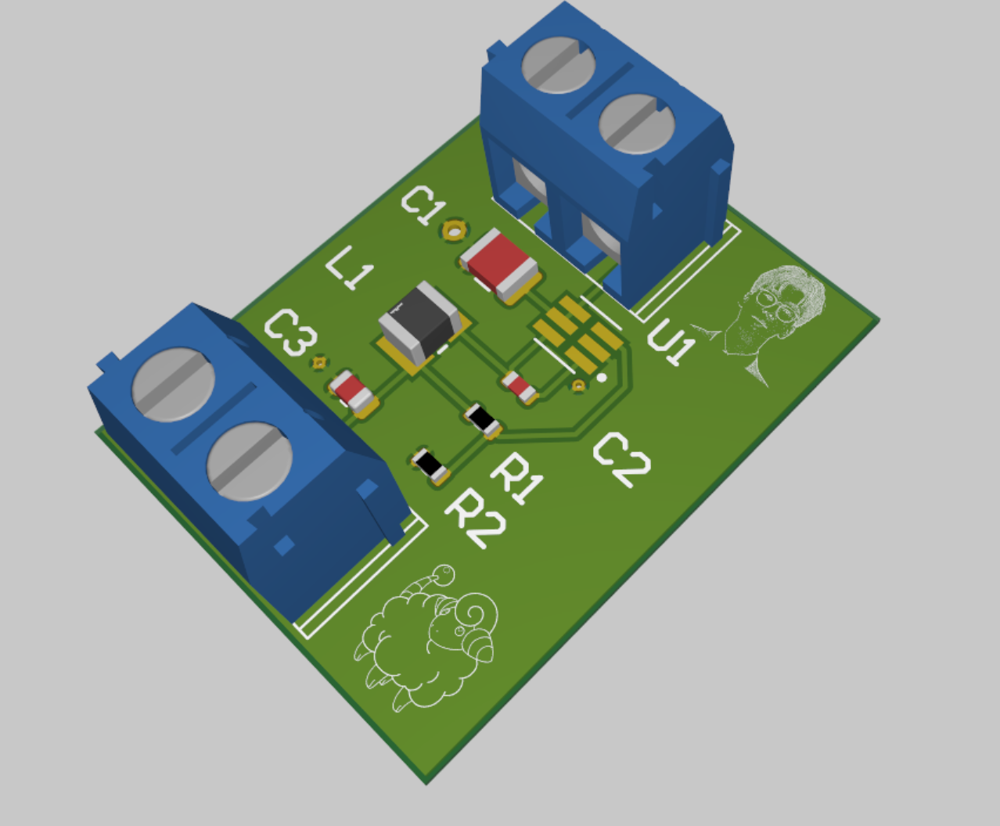
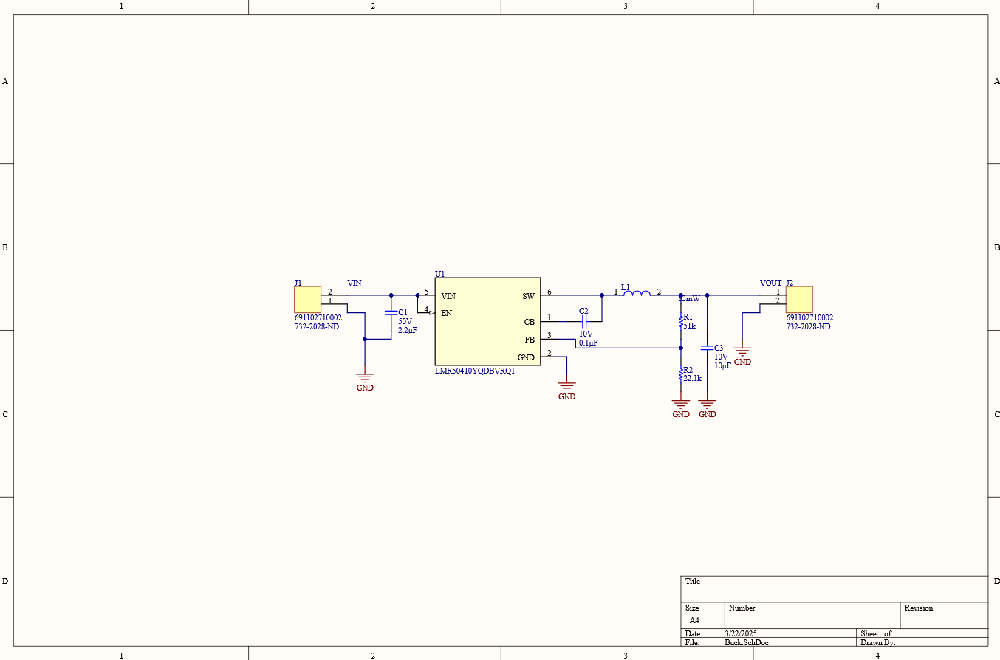
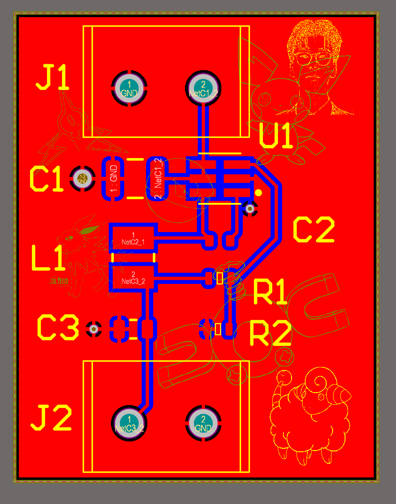
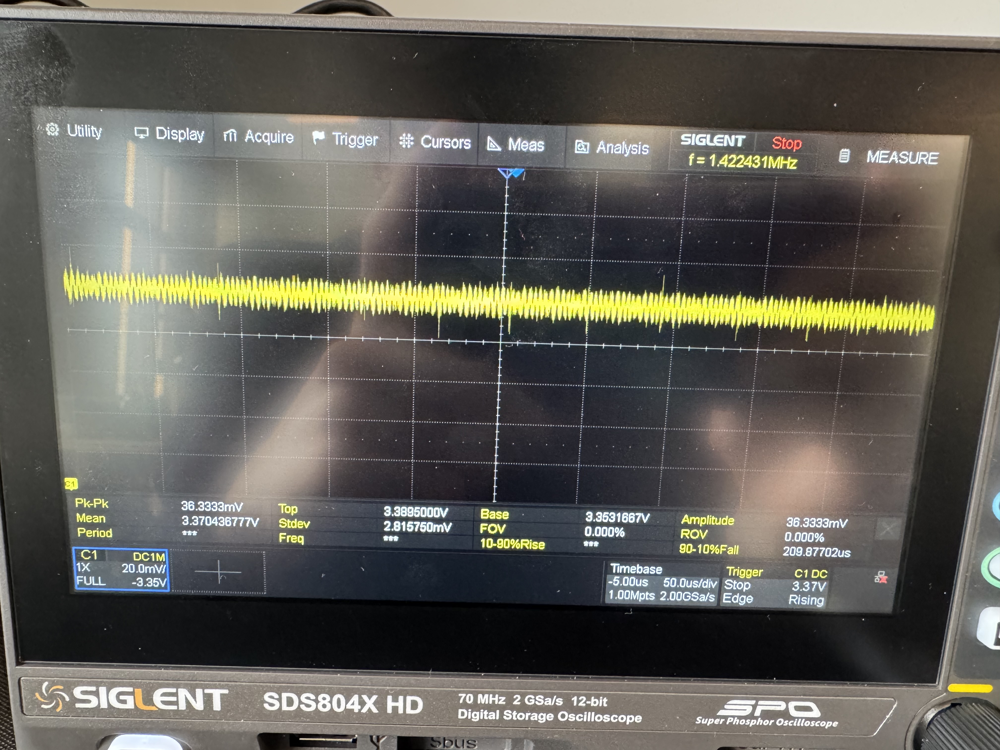

# <3V3 Buck Converter Project>

## Overview
A 3V3 buck converter designed to take a higher voltage input and output 3.3 volts, with an output ripple voltage of under 100mV.
## Key Images

### Schematic Overview

### PCB Layout

### Soldered PCB

### Ripple Voltage Testing

