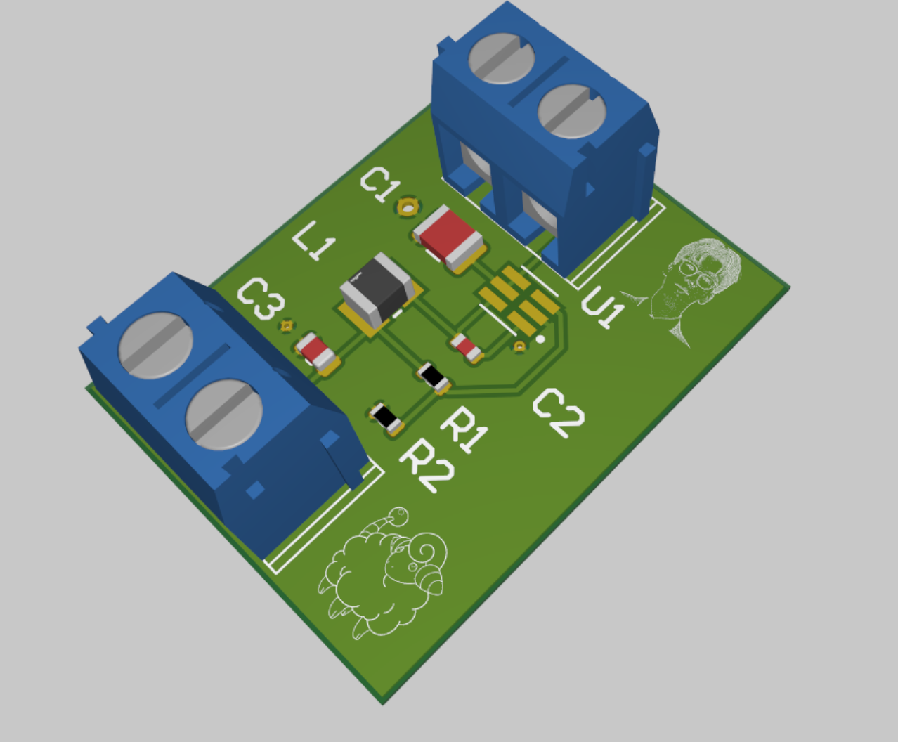
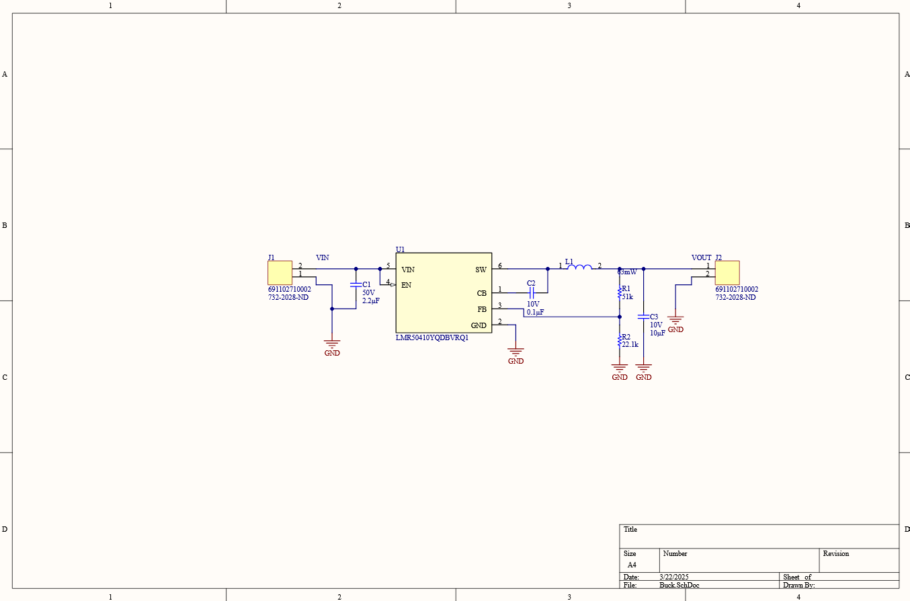
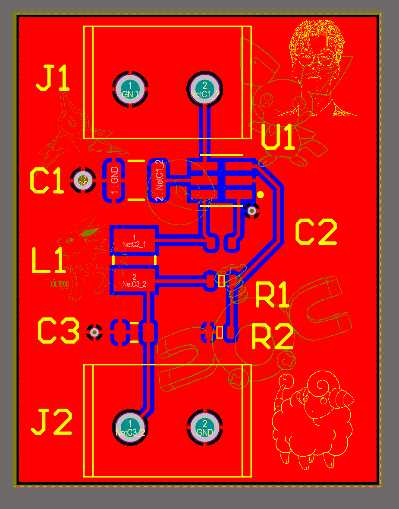
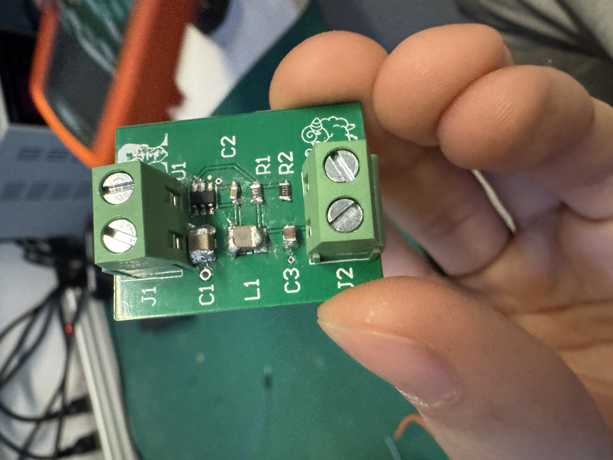
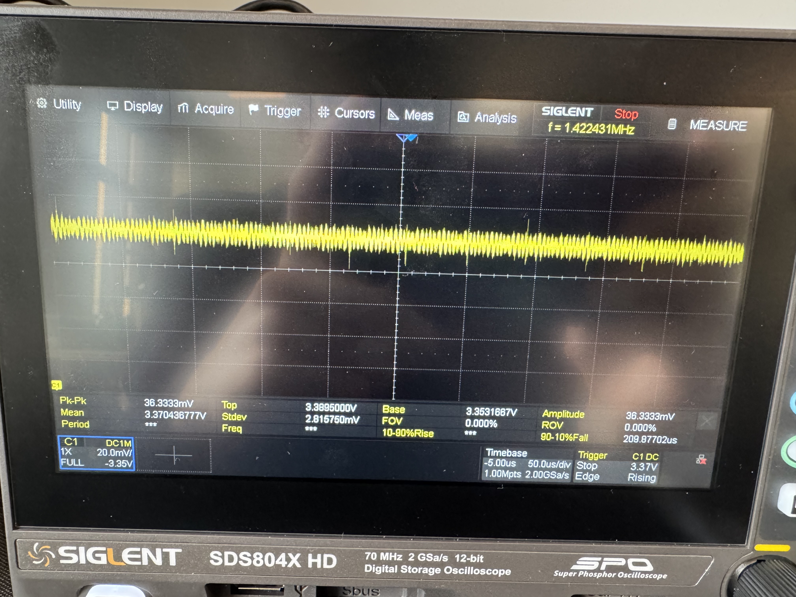
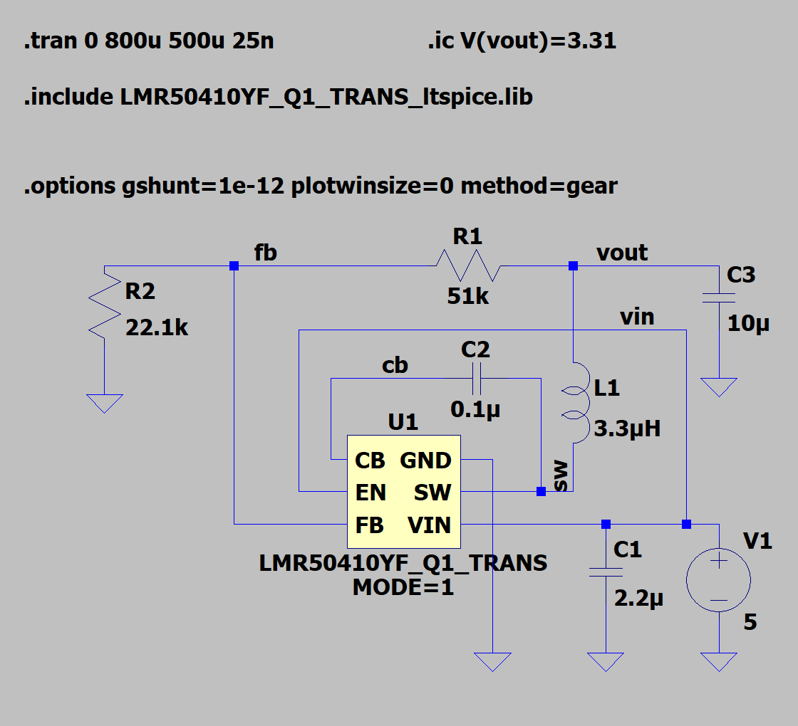
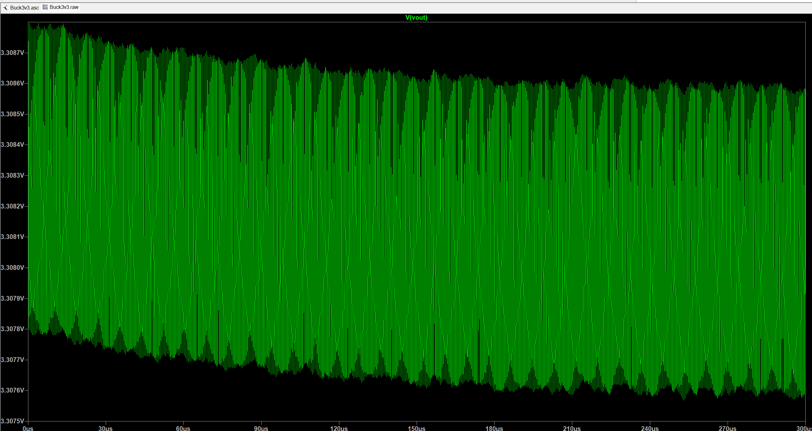
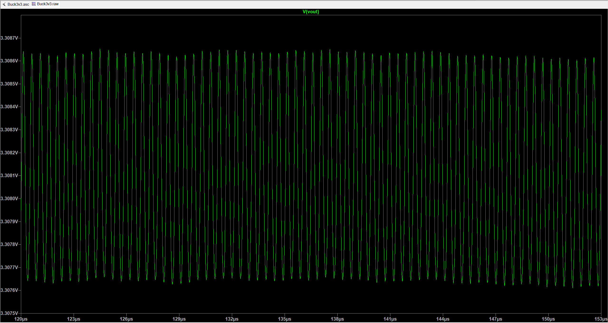
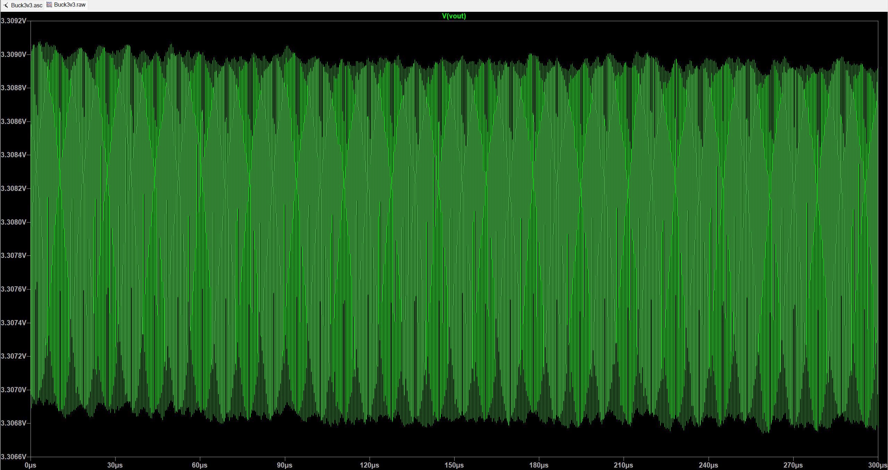
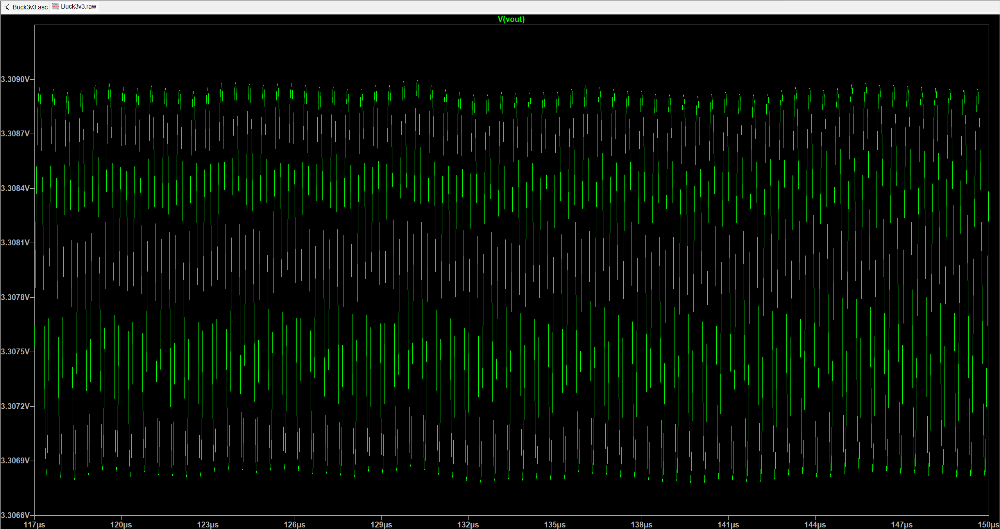

# 3V3 Buck Converter Project

Links:

**[Schematic + layout PDF](FAB-Lawrence_BuckConverter-A.1/Job1.PDF)**

**[BOM](FAB-Lawrence_BuckConverter-A.1/BOM/Lawrence_BuckConverter_BOM.xlsx)**

**[Fab package](FAB-Lawrence_BuckConverter-A.1/)**

## Overview
A 3V3 buck converter designed to take a higher voltage input and output 3.3 volts, with an output ripple voltage of under 100mV. 2-layer PCB with 9 components.
## Key Images

### Schematic Overview
Schematic of the 3V3 Buck converter. Uses a LMR50410 switcher.

### PCB Layout
This was the first ever PCB I made. I might have gone a little overboard on the line art.

### Soldered PCB

### Ripple Voltage Testing
As seen in the image, the buck converter meets the output ripple voltage requirement, with only 36mV Pk-Pk.

### LTspice Ripple Voltage Simulation
I ran an LTspice simulation of the buck converter with a 5V input and then a 12V input to compare to what was measured. I used the only unencrypted [LMR50410 PSpice model](https://www.ti.com/product/LMR50410-Q1#design-tools-simulation) from the Texas Instruments website and converted it to work with LTspice, so it may not match the component properties perfectly.

The 5V input simulation resulted in the following waveforms, with an output voltage ripple of around 0.99mV.

The 12V input simulation resulted in the following waveforms, with an output voltage ripple of around 2.13mV

These simulations show far lower output voltage ripple compared to the physical measurements. Potential causes for this discrepancy include ideal models for some components and the measurement noise.